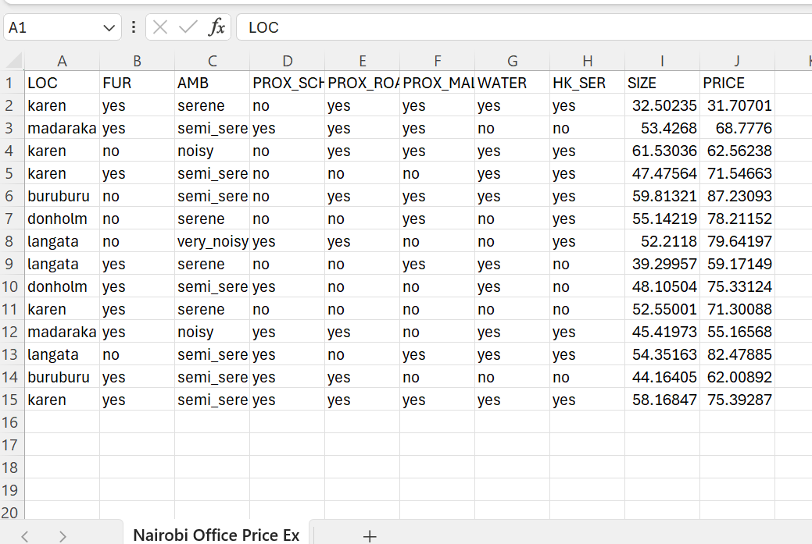
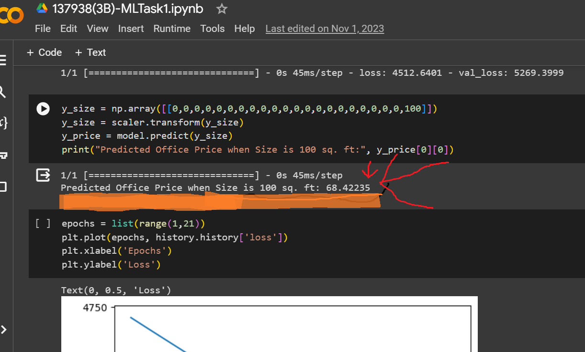

# RentPredictor

## Overview

RentPredictor is project end of 3rd year focused on training an intelligent Artificial Neural Network (ANN) model using the Nairobi Office Price Simulated dataset. The objective is to predict the office price when the size is 100 sq. ft. in Nairobi. The project falls under the category of Regression, specifically Linear Regression. The chosen Machine Learning (ML) model is an ANN, and Mean Squared Error (MSE) is used as the performance measure technique. The learning algorithm employed is the Adam Optimizer.

## Dataset

The dataset used in this project is the Nairobi Office Price Simulated dataset. You can find a screenshot of the dataset in the "screenshots" folder, named "dataset_screenshot.png."

## ML Model Details

- **Model Type:** Artificial Neural Network (ANN)
- **Performance Measure Technique:** Mean Squared Error (MSE)
- **Learning Algorithm:** Adam Optimizer

## Python Libraries Used

1. **Pandas:**
   - For data organization, access, and manipulation.
   - [Pandas Documentation](https://pandas.pydata.org/docs/getting_started/intro_tutorials/index.html)

2. **Matplotlib:**
   - For graphical data plots and visualization.
   - [Matplotlib Documentation](https://matplotlib.org/tutorials/introductory/pyplot.html#sphx-glr-tutorials-introductory-pyplot-py)

3. **Numpy:**
   - For vector, matrices, and complex number creations and manipulation.
   - [Numpy Documentation](https://numpy.org/devdocs/user/quickstart.html)

## Project Steps

### 1. Reading CSV File in Pandas and Creating DataFrames

- **Local File Reading:**
  - [Pandas - Reading and Writing Files](https://pandas.pydata.org/docs/getting_started/intro_tutorials/02_read_write.html)

- **CSV Reading in Google Colab:**
  - [Loading CSV Files into Colab](https://towardsdatascience.com/3-ways-to-load-csv-files-into-colab-7c14fcbdcb92)

### 2. Creating Subplots Using Matplotlib Pyplot

- [Matplotlib - Subplots Demo](https://matplotlib.org/devdocs/gallery/subplots_axes_and_figures/subplots_demo.html)

## Screenshots

1. **Dataset Screenshot:**
   

2. **Google Colab Result Run:**
   

Feel free to follow the links provided for detailed documentation on each library and step. Happy coding!
